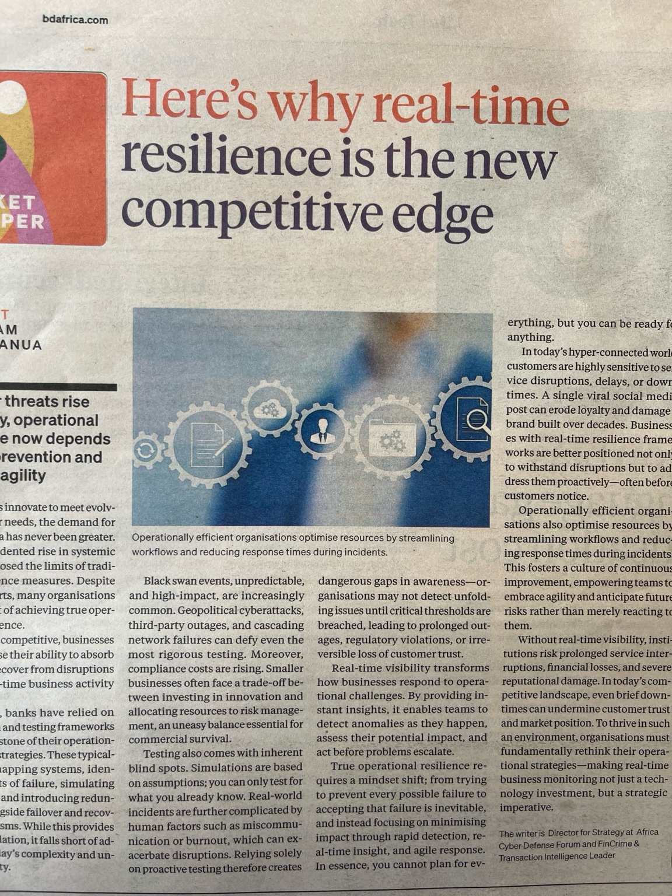

# Here's why real-time resilience is the new competitive edge

**MARKET WHISPER**

**ICT | SAM MANUA**

  

## As cyber threats rise every day, operational resilience now depends less on prevention and more on agility

As businesses innovate to meet evolving customer needs, the demand for real-time data has never been greater. The unprecedented rise in systemic risks has exposed the limits of traditional resilience measures. Despite genuine efforts, many organisations still fall short of achieving true operational resilience.

To remain competitive, businesses must prioritise their ability to absorb and swiftly recover from disruptions through real-time business activity monitoring.

For years, banks have relied on robust design and testing frameworks as the cornerstone of their operational resilience strategies. These typically involve mapping systems, identifying points of failure, simulating disruptions, and introducing redundancies alongside failover and recovery mechanisms. While this provides a solid foundation, it falls short of addressing today's complexity and unpredictability.

Operationally efficient organisations optimise resources by streamlining workflows and reducing response times during incidents.

Black swan events, unpredictable, and high-impact, are increasingly common. Geopolitical cyberattacks, third-party outages, and cascading network failures can defy even the most rigorous testing. Moreover, compliance costs are rising. Smaller businesses often face a trade-off between investing in innovation and allocating resources to risk management, an uneasy balance essential for commercial survival.

Testing also comes with inherent blind spots. Simulations are based on assumptions you can only test for what you already know. Real-world incidents are further complicated by human factors such as miscommunication or burnout, which can exacerbate disruptions. Relying solely on proactive testing therefore creates dangerous gaps in awareness—organisations may not detect unfolding issues until critical thresholds are breached, leading to prolonged outages, regulatory violations, or irreversible loss of customer trust.

Real-time visibility transforms how businesses respond to operational challenges. By providing instant insights, it enables teams to detect anomalies as they happen, assess their potential impact, and act before problems escalate.

True operational resilience requires a mindset shift: from trying to prevent every possible failure to accepting that failure is inevitable, and instead focusing on minimising impact through rapid detection, real-time insight, and agile response. In essence, you cannot plan for everything, but you can be ready for anything.

In today's hyper-connected world, customers are highly sensitive to service disruptions, delays, or downtimes. A single viral social media post can erode loyalty and damage a brand built over decades. Businesses with real-time resilience frameworks are better positioned not only to withstand disruptions but to address them proactively—often before customers notice.

Operationally efficient organisations also optimise resources by streamlining workflows and reducing response times during incidents. This fosters a culture of continuous improvement, empowering teams to embrace agility and anticipate future risks rather than merely reacting to them.

Without real-time visibility, institutions risk prolonged service interruptions, financial losses, and severe reputational damage. In today's competitive landscape, even brief downtimes can undermine customer trust and market position. To thrive in such an environment, organisations must fundamentally rethink their operational strategies—making real-time business monitoring not just a technology investment, but a strategic imperative.

*The writer is Director for Strategy at Africa Cyber Defense Forum and FinCrime & Transaction Intelligence Leader*

 
